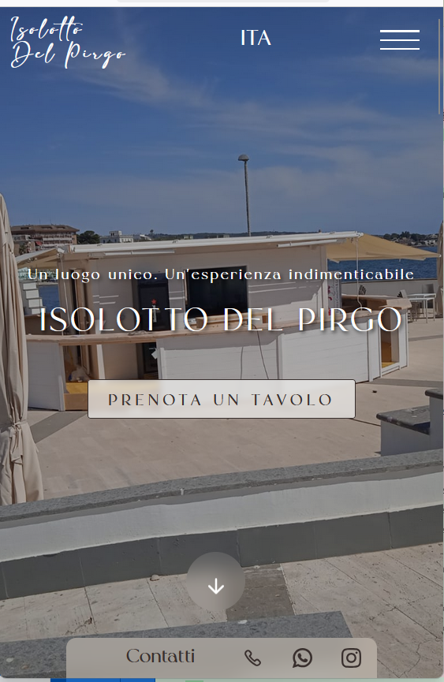

# 🌊 Isolotto del Pirgo - Sito Ufficiale

Benvenuto nel repository del sito ufficiale dell'**Isolotto del Pirgo**, un locale esclusivo situato a Civitavecchia (RM), affacciato sul mare e aperto durante tutta la stagione estiva.

Il sito è stato progettato e realizzato seguendo le indicazioni dirette del cliente, con particolare attenzione all’usabilità e allo stile visivo, ispirato ai migliori siti mondiali di ristorazione e hospitality.

👉 **Sito online:**  
https://isolotto-del-pirgo.vercel.app

---

## ✨ Funzionalità principali

- 🔥 **Design moderno e responsive**: perfettamente adattabile su desktop, tablet e smartphone.
- 🍽️ **Menu interattivo**: la pagina del menu offre una navigazione fluida tra le categorie (Antipasti, Bevande) grazie a una **navbar dinamica** che segue lo scroll e permette di saltare facilmente da una sezione all’altra.
- 📅 **Eventi**: sezione dedicata agli eventi organizzati dal locale.
- 🗺️ **Gallery & Mappa**: immagini ad alta qualità e mappa interattiva per raggiungere la location facilmente.
- 🛎️ **Prenotazioni**: possibilità di prenotare direttamente dal sito tramite la sezione dedicata.
- 🎯 **Animazioni professionali**: animazioni leggere e non invasive attivate allo scroll per migliorare l’esperienza utente.

---

## 🛠️ Tecnologie utilizzate

- **React.js**
- **React Router DOM**
- **Bootstrap & React-Bootstrap**
- **CSS3 (custom styling + animazioni)**
- **IntersectionObserver API (per animazioni on-scroll)**

---

## 📂 Struttura progetto (principale)

## /src /Assets /Components - Homepage.jsx - Menu.jsx - Footer.jsx - Navbar.jsx /Styles - Homepage.css - Menu.css - Footer.css - Navbar.css App.jsx index.js

---

## ▶️ Come eseguire il progetto localmente

1️⃣ **Clona il repository:**

```bash
git clone https://github.com/tuo-username/isolotto-del-pirgo.git
```

2️⃣ **Vai nella cartella del progetto:**

```bash
cd isolotto-del-pirgo
```

3️⃣ **Installa le dipendenze:**

```bash
npm install
```

4️⃣ **Avvia l'ambiente di sviluppo:**

```bash
npm start
```

Il sito sarà visibile su `http://localhost:3000`.

## 📸 Screenshot

### Homepage

<p align="center">
  
  
</p>

---

### Sezione Menu

<p align="center">
  
  
</p>

---

### Prenota

<p align="center">
  
  
</p>

## 👨‍💻 Sviluppatore

Sito realizzato da Cristiano Rocchi come progetto professionale su richiesta del cliente.  
Per info o collaborazioni:

- 📧 Email: cri.wklavoro@libero.it
- 💼 GitHub: [tuo-username](https://github.com/Cristiano-Rocchi)
